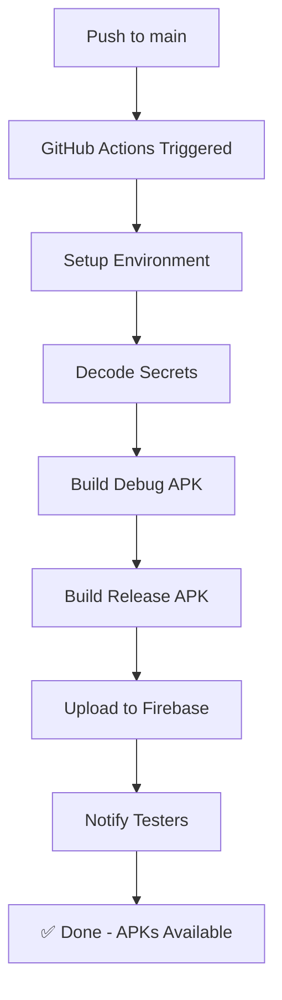

# 🚀 Firebase CI/CD Setup Guide for Payc App

## 📦 Project Information
- **Firebase Project ID**: `payc-c765d`
- **Firebase App ID**: `1:611955759822:android:1059bf9af9468b725bce9f`
- **Android Package Name**: `com.example.payc`
- **Keystore File**: `payc-release-key.jks`

---

## ✅ Step 1: Get Firebase App ID

1. Go to [Firebase Console](https://console.firebase.google.com/project/payc-d7a77/settings/general)
2. Navigate to **Project Settings** → **General** tab
3. Scroll to **Your apps** section
4. Find your Android app (`com.example.payc`)
5. Copy the **App ID** (format: `1:XXXXXXXXX:android:XXXXXXXXXXXXXXXX`)

**Save this as GitHub Secret:**
```
Name: FIREBASE_APP_ID
Value: [Your App ID from Firebase Console]
```

---

## ✅ Step 2: Create Firebase Service Account

### 2.1 Create Service Account
1. Go to [Google Cloud Console](https://console.cloud.google.com/iam-admin/serviceaccounts?project=payc-d7a77)
2. Click **+ CREATE SERVICE ACCOUNT**
3. **Service account name**: `github-actions-deploy`
4. **Service account ID**: `github-actions-deploy`
5. Click **CREATE AND CONTINUE**

### 2.2 Grant Permissions
Add these roles:
- ✅ **Firebase App Distribution Admin**
- ✅ **Service Account User**

Click **CONTINUE** → **DONE**

### 2.3 Create JSON Key
1. Click on the newly created service account
2. Go to **KEYS** tab
3. Click **ADD KEY** → **Create new key**
4. Select **JSON** format
5. Click **CREATE** (file will download automatically)

### 2.4 Prepare for GitHub Secret
The downloaded file will be named something like:
`payc-d7a77-firebase-adminsdk-xxxxx.json`

**Save this as GitHub Secret:**
```
Name: FIREBASE_SERVICE_ACCOUNT_JSON
Value: [Paste the ENTIRE content of the JSON file]
```

---

## ✅ Step 3: GitHub Secrets Configuration

Go to your GitHub repository:
**Settings** → **Secrets and variables** → **Actions** → **New repository secret**

### Required Secrets:

| Secret Name | Value | Location |
|-------------|-------|----------|
| `FIREBASE_APP_ID` | Your Firebase App ID | Firebase Console → Project Settings |
| `FIREBASE_SERVICE_ACCOUNT_JSON` | Entire JSON content | Downloaded service account JSON file |
| `GOOGLE_SERVICES_JSON_BASE64` | Base64 encoded | See file: `app/google-services-base64.txt` |
| `KEYSTORE_FILE_BASE64` | Base64 encoded | See file: `keystore-base64.txt` |
| `KEYSTORE_PASSWORD` | `payc2025` | From keystore.properties |
| `KEY_PASSWORD` | `payc2025` | From keystore.properties |
| `KEY_ALIAS` | `payc` | From keystore.properties |

---

## ✅ Step 4: Base64 Values (Already Generated)

### 📄 GOOGLE_SERVICES_JSON_BASE64
Location: `app/google-services-base64.txt`

**⚠️ IMPORTANT**: Your current `google-services.json` contains placeholder values. You MUST:
1. Download the real file from Firebase Console
2. Replace `app/google-services.json` with the real file
3. Re-run the Base64 encoding command:
```powershell
cd app
$content = Get-Content "google-services.json" -Raw
[Convert]::ToBase64String([System.Text.Encoding]::UTF8.GetBytes($content)) | Out-File -FilePath "google-services-base64.txt" -NoNewline
```

### 📄 KEYSTORE_FILE_BASE64
Location: `keystore-base64.txt`
✅ Already generated and ready to use

---

## ✅ Step 5: Enable Firebase App Distribution

1. Go to [Firebase Console](https://console.firebase.google.com/project/payc-d7a77/appdistribution)
2. Click **Get Started** (if not already enabled)
3. Select your Android app
4. Create a tester group named **"testers"**:
   - Click **Testers & Groups** tab
   - Click **Add Group**
   - Name: `testers`
   - Add email addresses of testers

---

## ✅ Step 6: Verify GitHub Actions Workflow

Your workflow file is already created at:
`.github/workflows/android.yml`

### What happens when you push to `main`:

1. ✅ Checkout code
2. ✅ Setup JDK 17
3. ✅ Decode keystore from Base64
4. ✅ Create `keystore.properties`
5. ✅ Decode `google-services.json` from Base64
6. ✅ Build Debug APK
7. ✅ Build Release APK (signed)
8. ✅ Upload Debug APK to Firebase App Distribution
9. ✅ Upload Release APK to Firebase App Distribution
10. ✅ Notify testers group

---

## ✅ Step 7: Generate SHA-1 and SHA-256 (Optional but Recommended)

For Firebase Authentication, Dynamic Links, etc.:

```powershell
# For Debug Keystore
keytool -list -v -keystore "$env:USERPROFILE\.android\debug.keystore" -alias androiddebugkey -storepass android -keypass android | Select-String "SHA1|SHA256"

# For Release Keystore
keytool -list -v -keystore "payc-release-key.jks" -alias payc -storepass payc2025 -keypass payc2025 | Select-String "SHA1|SHA256"
```

Add these fingerprints to Firebase:
1. Firebase Console → Project Settings
2. Scroll to **Your apps** → Select Android app
3. Click **Add fingerprint**
4. Paste SHA-1 and SHA-256

---

## 🎯 Final Checklist

Before pushing to `main`, ensure:

- [ ] Real `google-services.json` downloaded from Firebase Console
- [ ] Firebase App Distribution enabled
- [ ] Service Account JSON created with correct permissions
- [ ] All 7 GitHub Secrets added
- [ ] Tester group "testers" created in Firebase
- [ ] SHA-1/SHA-256 added to Firebase (optional)

---

## 🚀 Testing the Workflow

1. Commit and push to main:
```bash
git add .
git commit -m "Setup Firebase CI/CD"
git push origin main
```

2. Go to GitHub → **Actions** tab
3. Watch the workflow run
4. After success, check Firebase App Distribution:
   - [Firebase Console - App Distribution](https://console.firebase.google.com/project/payc-d7a77/appdistribution)

---

## 📱 Firebase App Distribution Links

### For Testers:
After the first successful build, testers will receive an email with download link.

### Direct Console Link:
[https://console.firebase.google.com/project/payc-d7a77/appdistribution](https://console.firebase.google.com/project/payc-d7a77/appdistribution)

### Tester Download Page:
[https://appdistribution.firebase.dev/i/XXXXXXXX](https://appdistribution.firebase.dev/i/XXXXXXXX)
*(Link will be generated after first upload)*

---

## 🔧 Troubleshooting

### Build Fails with "google-services.json not found"
- Ensure `GOOGLE_SERVICES_JSON_BASE64` secret is set correctly
- Verify the Base64 encoding was done on the REAL file, not placeholder

### Release APK not signed
- Verify all keystore secrets are correct
- Check `keystore.properties` is created correctly in workflow

### Firebase upload fails
- Verify `FIREBASE_SERVICE_ACCOUNT_JSON` has correct permissions
- Ensure App Distribution is enabled in Firebase Console
- Check `FIREBASE_APP_ID` matches your app

---

## 📊 What Happens on Each Push to Main



**Timeline**: ~5-10 minutes per build

**Result**: 
- Debug APK available in Firebase App Distribution
- Release APK available in Firebase App Distribution
- Testers receive email notification
- Download links active immediately

---

## 🎉 Success Indicators

After successful setup, you'll see:
1. ✅ Green checkmark in GitHub Actions
2. ✅ Two new releases in Firebase App Distribution
3. ✅ Email notifications sent to testers
4. ✅ APKs downloadable from Firebase console

---

**Created**: 2025-12-02
**Project**: Payc App
**Firebase Project**: payc-d7a77
